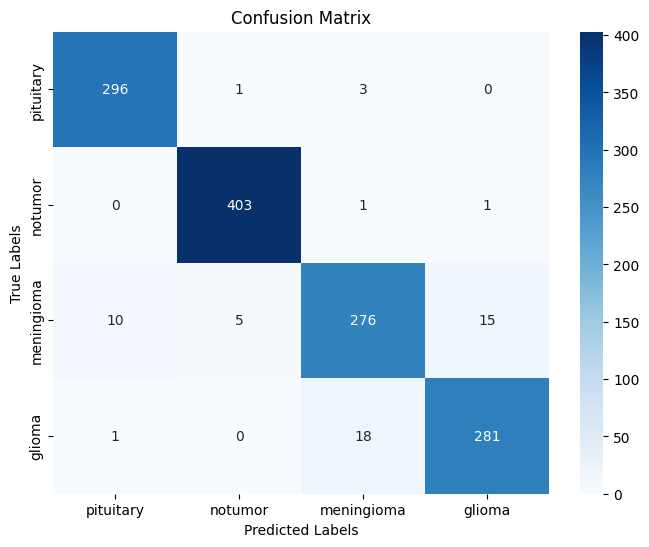

# 🧠 Brain Tumor Detection Using Deep Learning

## 📌 Introduction & Problem Statement

### 🎯 Project Goal
This project aims to develop an **automated deep learning system** capable of detecting and classifying **brain tumors** from medical images using **Convolutional Neural Networks (CNNs)**. By doing so, we enhance diagnostic precision and accelerate early medical intervention.

### ❗ Problem Statement
Brain tumors are among the most severe and life-threatening neurological conditions. Early detection plays a vital role in increasing survival rates. However, traditional MRI-based diagnostics are:
- **Time-consuming**
- **Prone to human error**
- **Highly reliant on radiologist availability**

To overcome these challenges, we leverage **CNNs** for fast, reliable, and accurate brain tumor classification, supporting healthcare professionals with **automated image analysis**.

### 🚀 Why This Matters
This project introduces a modern, **AI-powered solution** that:
- Reduces diagnostic time
- Minimizes human error
- Increases accessibility to diagnostic tools
- Improves early intervention and treatment outcomes

---

## 🗺️ Table of Contents

1. [Introduction & Problem Statement](#-introduction--problem-statement)
2. [Project Methodology / Roadmap Overview](#-project-methodology--roadmap-overview)
3. [Data Acquisition & Initial Exploration](#-data-acquisition--initial-exploration)
    - 3.1 Importing Tools/Required Libraries  
    - 3.2 Data Loading  
    - 3.3 Initial Exploration
4. [Data Preprocessing (Helper Functions)](#-data-preprocessing-helper-functions)
5. [Model Development & Training](#-model-development--training)
    - 5.1 Model Selection & Training Strategy (Fine-tuning)
6. [Model Evaluation](#-model-evaluation)
    - 6.1 Accuracy Plot  
    - 6.2 Classification Report  
    - 6.3 Confusion Matrix  
    - 6.4 ROC Curve
7. [Model Persistence](#-model-persistence)
    - 7.1 Saving & Loading the Model
8. [System Integration / Deployment](#-system-integration--deployment)
9. [Key Insights & Learnings](#-key-insights--learnings)
10. [Deep Dive / Bonus Read](#-deep-dive--bonus-read)
    - 10.1 `sparse_categorical_crossentropy` vs `categorical_crossentropy`
11. [Conclusion & Future Work](#-conclusion--future-work)

---

## 🧭 Project Methodology / Roadmap Overview

```
1️⃣ Data Acquisition & Initial Exploration → 2️⃣ Preprocessing → 3️⃣ Model Building →  
4️⃣ Training & Validation → 5️⃣ Evaluation → 6️⃣ Persistence
```

---

## 📥 Data Acquisition & Initial Exploration

### ✅ Tools Used
- TensorFlow / Keras
- NumPy, Pandas
- Matplotlib, Seaborn
- Sklearn

### 🔍 Dataset Details
The dataset contains MRI images of brain scans labeled according to tumor type.

### 📂 Sample Data Structure:
```
/BrainTumorData/
    ├── glioma/
    ├── meningioma/
    ├── pituitary/
    └── no_tumor/
```

---

## 🧹 Data Preprocessing

- Resize & normalize images
- One-hot encode labels
- Create training/validation/test splits
- Data augmentation to prevent overfitting

---

## 🧠 Model Development & Training

### 🔧 Model Selection
- Pre-trained CNN models (**VGG16**)
- Transfer learning applied via fine-tuning

### 🏋️‍♂️ Training Strategy
- Optimizer: Adam  
- Loss Function: `sparse-categorical_crossentropy`  
- Metrics: Accuracy, Precision, Recall  

---

## 📊 Model Evaluation

### 📈 6.1 Training & Validation Accuracy


### 🧾 6.2 Classification Report
Provides precision, recall, and F1-score per class.

### 🔄 6.3 Confusion Matrix


### 🚦 6.4 ROC Curve
Visualizes model performance across thresholds.


---

## 💾 Model Persistence

- Saved with `keras` format
- Loaded easily for deployment/inference

```python
# Save model
model.save("model.keras", include_optimizer=False)

# Load model
from tensorflow.keras.models import load_model
model = load_model("brain_tumor_model.keras")
```

---

## 🌐 System Integration / Deployment

The model's inference capabilities were verified through an interactive testing interface developed within the Google Colab notebook. Users could upload brain MRI images and immediately receive a prediction on the tumor type, effectively demonstrating its real-time prediction functionality in a controlled environment.

### 🔗 Sample Interface:
```text
[Upload MRI Image] → [Predict] → [Tumor Type Output]
```

---

## 💡 Key Insights & Learnings

- CNNs are highly effective for medical image classification.
- Transfer learning significantly boosts performance with smaller datasets.
- Preprocessing and augmentation play critical roles in model generalization.

---

## 🔬 Deep Dive / Bonus Read

### `sparse_categorical_crossentropy` vs `categorical_crossentropy`
- Use `sparse_categorical_crossentropy` when labels are integers.
- Use `categorical_crossentropy` when labels are one-hot encoded.

---

## 🏁 Conclusion & Future Work

### ✅ Achievements:
- Developed a CNN-based model with high accuracy
- Demonstrated real-time deployment
- Provided an automated and scalable tumor detection system

### 🔮 Future Improvements:
- Incorporate more diverse datasets
- Explore 3D CNNs for volumetric MRI data
- Add interpretability via Grad-CAM/heatmaps

---

## 📎 License

This project is licensed under the **MIT License**.

---

## 🙌 Acknowledgements

- Kaggle datasets
- TensorFlow / Keras documentation
- Open Source Contributions from the AI/ML community

---

## 📬 Contact

**Developer**: Kalihose Migisha  
**Email**: KalihoseMigisha@gmail.com  
**GitHub**: [KalihoseMigisha](https://github.com/KalihoseMigisha)  
**X (Twitter)**: [KalihoseMigisha](https://x.com/KalihoseMigisha)
